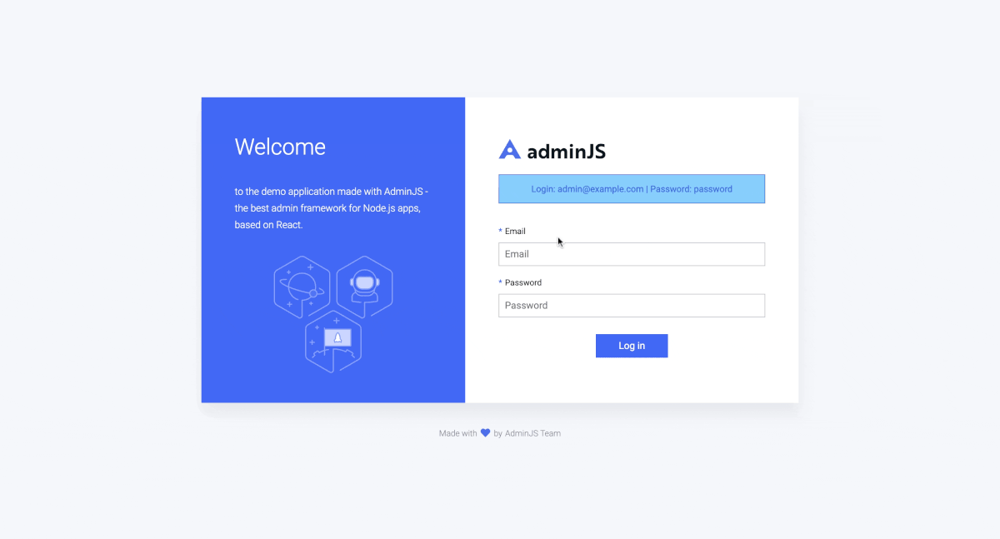

# Ksike framework: Admin Js integration 
AdminJS is an open-source admin panel for your Node.js application. It does not force it's database schema upon your application; instead, it integrates with your Node.js server and the ORM/ODM you are using.

The UI components are written in React and you can fully customize the admin panel.
AdminJS also generates it's own REST API which you can use outside of the admin panel or use it to integrate it with your other applications.




For further information consult the following links:

- https://docs.adminjs.co/installation/getting-started#overview
- https://docs.adminjs.co/installation/plugins/express
- https://docs.adminjs.co/installation/adapters/sequelize

## Install

- Set the configuration file: `cfg\core.json`

```json
{
  "onLoadedModules": ["ksmf.adminjs.wrapper"],
  "helper": {
      "ksmf.adminjs.wrapper": {
        "name": "ksmf-adminjs",
        "type": "lib",
        "dependency": {
          "helper": "helper"
        }
      }
  }
}
```
- Check the project URL at **/admin**

